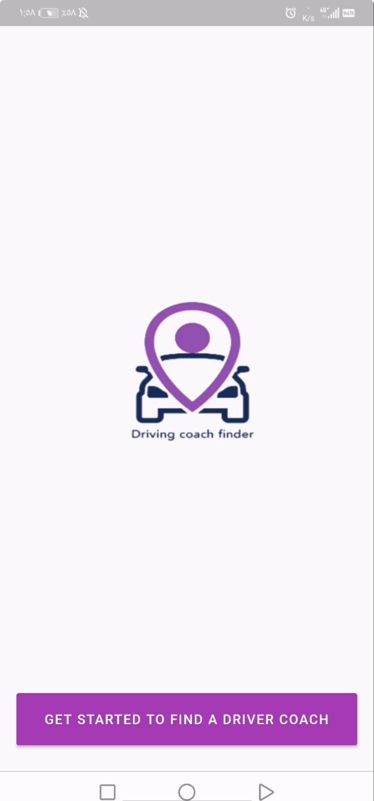
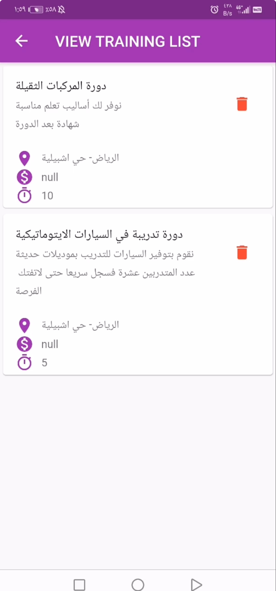

# تطبيق لتسهيل العثور على مدربات قيادة — دراسة حالة UX

## مقدمة
هذا المشروع عبارة عن دراسة حالة UX لتطبيق يساعد المستخدمين في العثور على مدربات قيادة بسهولة في مدنهم، مع عرض ملفات التعريف، التواصل، والتقييمات.

---

## هدف المشروع
- تسهيل عملية البحث عن مدربات القيادة.
- توفير تجربة مستخدم سهلة وسلسة.
- عرض معلومات المدربة بشكل واضح (اسم، موقع، تقييم، سعر).

---

## خطوات العمل
1. البحث وفهم المستخدمين.
2. تصميم تدفق المستخدم (User Flow) والنماذج الأولية.
3. تصميم واجهة المستخدم (UI).
4. اختبار المستخدمين وتحسين التصميم.
5. التوثيق.

---

## لقطات من التصميم

---

## معلومات إضافية
- الأدوات المستخدمة: Figma.
- مدة المشروع: 4 أسابيع.
---

## ملاحظات
*باقي الأقسام قيد الإضافة.*

